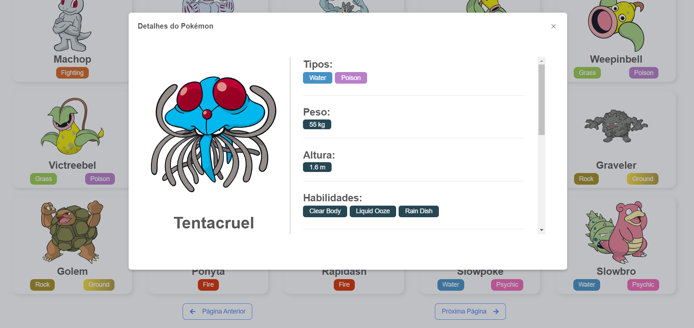

<h4 align="center">

<br><br>
👾 Saiba mais sobre seus pokemons favoritos com o Pokemon Listing  👾
</h4>
<p align="center">
    
    
    
    
    
</p>

# :bulb: Sobre o projeto 

Esse projeto consiste em uma Wiki do universo Pokémon, emglobando os animes, filmes e jogos da franquia.
Nele você poderá fazer um cadastro de usuário, logar no sistema com seu login e senha e por fim vizualizar diversos Pokémons disponiveis na [PokeAPI](https://pokeapi.co/docs/v2).

# ⚙️ Como executar


Para executar e testar a aplicação na sua máquina, primeiramente clone o repositório no seu computador.
Após fazer o fork e ter todos os arquivos na sua maquina, siga os seguintes passos:

### Iniciar Servidor

Antes de inicializar o servidor, você deve entrar na pasta **"./backend"** e renomear o arquivo **".env-example"** para **".env"**.
Agora, para instalar todas as dependências do servidor, entre na pasta **"./backend"** e execute o seguinte comando:

```bash
$ npm install
```
Agora para criar a estrutura base do banco de dados, execute o comando:

```bash
$ npm run knex:migrate
```
Com as dependências instaladas e o banco de dados pronto, execute este comando para iniciar o servidor:

```bash
$ npm start
```

### Iniciar App Web

Após iniciar a execução do servidor, inicie a aplicação web entrando na pasta **"./frontend"** e executando os comandos:

```bash
$ npm install
$ npm start
```

**E pronto, agora você pode usar à vontade toda a aplicação.** :)

# 🧑🏽‍💻 Tecnologias

Segue abaixo uma lista com as principais técnologias utilizados no desenvolvimento desta aplicação.

### ⚛️ Frameworks
- [x] [Node.js](https://nodejs.org/en/) 
- [x] [React](https://pt-br.reactjs.org/)

### 📚 Bibliotecas e Dependências
- [x] [Express](https://expressjs.com/)
- [x] [Axios](https://github.com/axios/axios)
- [x] [JWT (Json Web Token)](https://jwt.io/)
- [x] [React Suite](https://rsuitejs.com/)
- [x] [Styled Components](https://styled-components.com/)

### 🏛 Banco de dados
- [x] [Knex](http://knexjs.org/)
- [x] [SQLite](https://www.mysql.com/)


# :computer: Imagens da Pagina Web

<p align="center">
  
  
  
  
  
  
</p>

 # :tv: Redes Sociais
 Me siga nas minhas redes sociais 😊
 
   <p>
  <a href="https://github.com/AbnerPS" target="__blank">
    
  </a>

  <a href="https://www.linkedin.com/in/abner-pereira-silva-8715a326/" target="__blank">
    
  </a>

  <a href="https://codepen.io/Abner_Silva" target="__blank">
    
  </a>

  <a href="https://www.facebook.com/AbnerGuthiwill/" target="__blank">
    
  </a>
</p>
